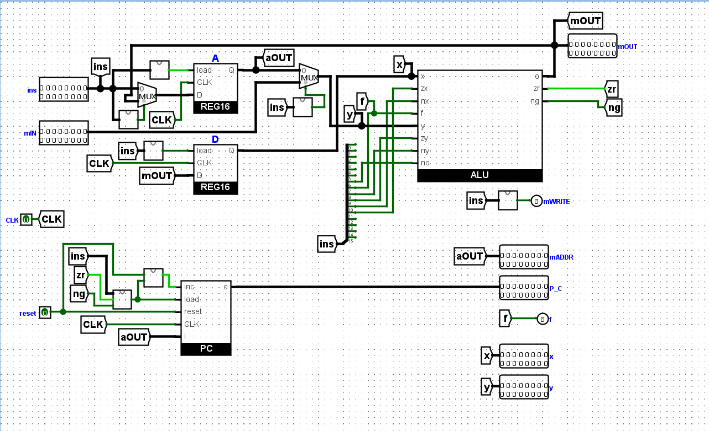
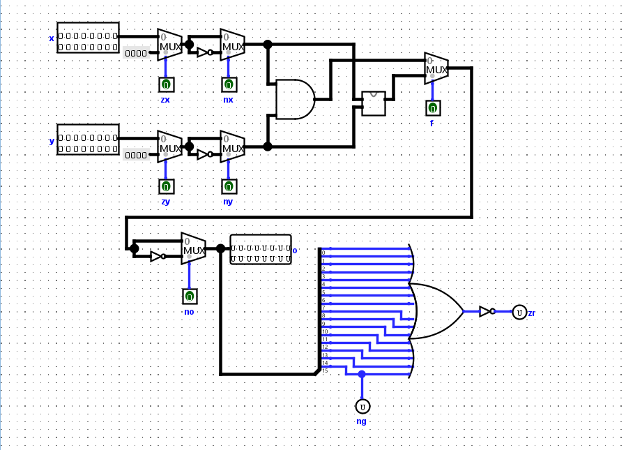
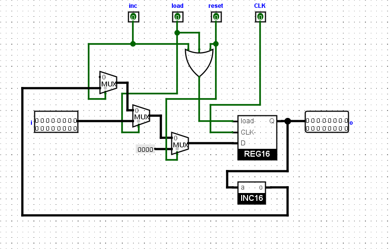
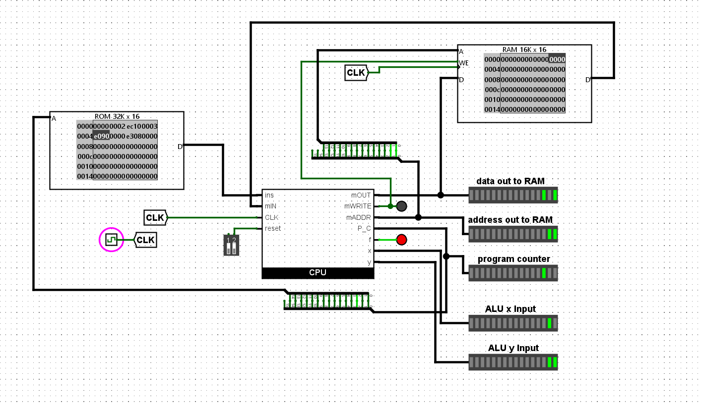

# 16 Bit CPU Design | Logisim-Evolution

Welcome to the 16 Bit CPU Design project! This repository contains a simple design of a 16-bit CPU implemented using Logisim-Evolution, an educational tool for designing and simulating digital logic circuits.

## Overview

This project demonstrates the architecture and functioning of a simple 16-bit CPU. The design includes essential components such as the arithmetic logic unit (ALU), registers, and memory. The CPU is capable of performing basic summing operation, data movement, and control flow instructions.

## Features

- **16-bit ALU**: Handles arithmetic and logical operations.
- **Registers**: Temporary storage for data and instructions.
- **Memory**: Stores instructions and data.
- **Instruction Set**: Supports a basic set of instructions for computation and control.
- **Sample Code in ROM**: Includes a basic set of instructions to sum 2 + 3 and write the result into RAM, pre-loaded into the ROM.

## Screenshots

Here are some screenshots showcasing different parts of the CPU design:

### CPU Overview


### ALU Design


### Program Counter


### Main Overview


## Getting Started

To explore the CPU design, follow these steps:

1. **Clone the Repository**:
    ```bash
    git clone https://github.com/emretuncer256/16-bit-cpu-design.git
    ```

2. **Open in Logisim-Evolution**:
    - Download and install [Logisim-Evolution](https://github.com/logisim-evolution/logisim-evolution).
    - Open the `CPU.circ` file in Logisim-Evolution.

3. **Simulate and Test**:
    - Use Logisim-Evolution's simulation tools to test the CPU's functionality.
    - Modify and extend the design as needed.


## License

This project is licensed under the MIT License. See the [LICENSE](LICENSE) file for details.

## Acknowledgments

- [Logisim-Evolution](https://github.com/logisim-evolution/logisim-evolution) for providing an excellent tool for designing and simulating digital circuits.

Thank you for checking out the 16 Bit CPU Design project. Happy designing and simulating!